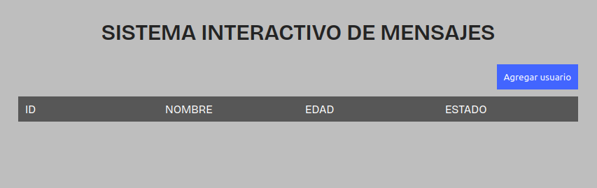

### SISTEMA INTERACTIVO DE MENSAJES



```
Es un proyecto para mensajes interactivos, el cual mostrara un mensaje dependiendo de la edad del usuario y validara esos datos y almacenara para mostrarlos en pantalla.
```

## Pre-requisitos 📋

    * Computador
    * Navegador actualizado
    * Node ( ultima version o en su defecto v22.16.0 )
    * Visual Estudio Code

## Instalacion ⚙️ 
    
  Clona el repositorio
```
  git clone https://github.com/Ajvilla99/riwi-m3-js-week1.git

```
  Entra al directorio
```
  cd proyecto
```


## Estructura
    📦 proyecto
    ┣ 📂 assets
    ┃ ┣ 📂 css
    ┃ ┃ ┗ 📜 reset.css
    ┣ 📜 index.html
    ┣ 📜 sistema_interactivo.js
    ┣ 📜 style.css
    ┗ 📜 README.md

# Funcionalidades
* Agregar un usuario

```
Es una funcion que se ejecutara cuando se le de click al boton agregar usuario, la cual pedira datos al usuario tales como nombre y edad.
```

## Tecnologias usadas

    - HTML
    - CSS
    - JAVASCRIPT

## Contribuyendo 🖇️

    Abrahan Villa

